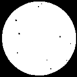
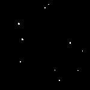

# `binary_to_semantic` (and reverse)

---

`binary_to_semantic` converts segmented binary images, where metal is labeled as True (white) and air/pores as False (black), into semantic image stacks with distinct integer labels for each constituent (air, metal, and porosity), facilitating separate analyses for each class in the context of x-ray computed tomography data of additively manufactured tensile samples containing porosity.

---

With recon3d installed in a virtual environment called .venv, the ``binary_to_semantic`` and ``semantic_to_binary`` functionality is provided as a command line interface.  Semantic image stacks are one of the key datatypes used in the ``recon3d module``, and are a key class of segmented data in the broader field of image processing. Segmented data broadly encompasses any annotated image that can be used for subsequent image processing or analysis, and a binarized image can be considered to be the simplest case of an image segmentation.

For the case of grayscale x-ray computed tomography data (a key application of the ``recon3d`` module), a binarized image for a metallic sample containing internal voids could simply distinguish between metal and air, with air encompassing both the region outside the metal sample and any internal porosity, where metal is labelled with True ***(white)*** values and air is labelled with False ***(black)*** values:

```yml
<!-- cmdrun cat binary_to_semantic.yml -->
```

Text in between

```yml
<!-- cmdrun cat semantic_to_binary.yml -->
```

Text after

 

Figure: (left) segmented binary image, where metal = 1 or True ***(white)*** and everything else = 0 or False ***(black)***; (right) semantic image, where classes are labeled as air = 0 ***(black)***, metal = 1 ***(gray)*** and internal porosity = 2 ***(white)***

  

Figure: Binary images from the class labels where only (left) air is 1 or True ***(white)***, (center) metal is 1 or True ***(white)***, (right) internal porosity is 1 or True ***(white)***

To perform analyses on the metal or the pores independently for these images, we must convert these images to a semantic image stack, in which each separate constituent (air, metal, and porosity) is labelled with a unique integer label. In this way, semantic images group objects based on defined categories. 

--- 

Following is an example of the `binary_to_semantic` and `semantic_to_binary` workflow **specifically designed for the NOMAD 2024 binarized CT data, where metal is labelled as "True" and the air/pores are labelled as "False"**.

---

In this demonstration using the "cylinder_machined" example data, the semented binary image stack of the metal cylinder containing pores can be converted to a semantic image stack where the air, metal and pores are assigned class labels 0,1,2, respectively.

Provided a segmented image stack containing a continious phase, such as the metal, containing pores, the semantic image stack can be generated using: 

For macOS/Linux:

```
binary_to_semantic .venv/lib/python3.11/site-packages/recon3d/examples/binary_to_semantic.yml
```

For Windows:

```
binary_to_semantic .venv\Lib\site-packages\recon3d\examples\binary_to_semantic.yml
```

The program output follows for Windows:

```
Processing specification file: .venv\Lib\site-packages\recon3d\examples\binary_to_semantic.yml
Success: database created from file: .venv\Lib\site-packages\recon3d\examples\binary_to_semantic.yml
key, value, type
---, -----, ----
cli_entry_points, ['binary_to_semantic'], <class 'list'>
image_dir, recon3d/data/cylinder_machined_binary, <class 'str'>
out_dir, recon3d/data/output/binary_to_semantic, <class 'str'>
Input path: recon3d\data\cylinder_machined_binary
Output path: recon3d\data\output\binary_to_semantic
Images read, image array size: (21, 150, 150)
        Isolating Sample...
        Isolating Voids...
class labels for semantic stack:
{'class_labels': {'air': {'value': 0}, 'metal': {'value': 1}, 'pore': {'value': 2}}}
.venv\Lib\site-packages\recon3d\examples\binary_to_semantic.yml processed!
```

Provided a semantic image stack with labeled classes, the instances of each class can be generated using: 

For macOS/Linux:

```
semantic_to_binary .venv/lib/python3.11/site-packages/recon3d/examples/semantic_to_binary.yml
```

For Windows:

```
semantic_to_binary .venv\Lib\site-packages\recon3d\examples\semantic_to_binary.yml
```

The program output follows for Windows:

```
Processing specification file: .venv\Lib\site-packages\recon3d\examples\semantic_to_binary.yml
Success: database created from file: .venv\Lib\site-packages\recon3d\examples\semantic_to_binary.yml
key, value, type
---, -----, ----
cli_entry_points, ['semantic_to_binary'], <class 'list'>
image_dir, recon3d/data/cylinder_machined_semantic, <class 'str'>
out_dir, recon3d/data/output/semantic_to_binary, <class 'str'>
selected_class, pores, <class 'str'>
class_labels, {'air': {'value': 0}, 'metal': {'value': 1}, 'pores': {'value': 2}}, <class 'dict'>
Input path: recon3d\data\cylinder_machined_semantic
Output path: recon3d\data\output\semantic_to_binary
Images read, image array size: (21, 150, 150)
.venv\Lib\site-packages\recon3d\examples\semantic_to_binary.yml processed!
```
