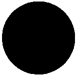

# `binary_to_semantic` (and reverse)

---

`binary_to_semantic` converts segmented binary images, where metal is labeled as True (white) and air/pores as False (black), into semantic image stacks with distinct integer labels for each constituent (air, metal, and porosity), facilitating separate analyses for each class in the context of x-ray computed tomography data of additively manufactured tensile samples containing porosity.

---

Segmented data broadly encompasses any annotated image that can be used for subsequent image processing or analysis, and a binarized image can be considered to be the simplest case of an image segmentation. Often, grayscale x-ray computed tomography data (a key application of the `recon3d` module), a binarized image for a metallic sample containing internal voids can easily distinguish the metal and air, with air encompassing both the region outside the metal sample and any internal porosity.

---

Following is an example of the `binary_to_semantic` and `semantic_to_binary` workflow **specifically designed for the NOMAD 2024 binarized CT data, where metal is labelled as "True" and the air/pores are labelled as "False"**.

---

Here an example image from a x-ray CT cross-section of a metal cylinder with voids will be used for demonstration. The segmented binary image contains pixel values where metal = 1 or True ***(white)*** and everything else = 0 or False ***(black)***

<figure>
<p align="center" width="100%">
    
    <figcaption>
    <div style="text-align: center; font-style: italic;">
    Segmented binary image
</div>
</figcaption>
</p>
</figure>

Semantic image stacks are one of the key datatypes used in the `recon3d` module, and are a key class of segmented data in the broader field of image processing. To perform statistical analyses on the metal or the pores independently for these images, we must convert binary image stacks to a semantic image stack, in which each separate constituent (air, metal, and porosity) is labelled with a unique integer label. In this way, semantic images group objects based on defined categories. Following the example above, the classes are labeled as air = 0 ***(black)***, metal = 1 ***(gray)*** and internal porosity = 2 ***(white)***.

<figure>
<p align="center" width="100%">
    
    <figcaption>
    <div style="text-align: center; font-style: italic;">
    Semantic image
</div>
</figcaption>
</p>
</figure>

With recon3d installed in a virtual environment called .venv, the `binary_to_semantic` and `semantic_to_binary` functionality is provided as a command line interface.

Contents of `binary_to_semantic.yml`:
```yml
<!-- cmdrun cat binary_to_semantic.yml -->
```

Contents of `semantic_to_binary.yml`:
```yml
<!-- cmdrun cat semantic_to_binary.yml -->
```

To further illustrate the semantic image stack, binary images from the class labels are shown. On the (left) air is 1 or True ***(white)***, (center) metal is 1 or True ***(white)***, (right) internal porosity is 1 or True ***(white)***

<p align="center" width="100%">
  &nbsp;&nbsp;&nbsp;&nbsp;&nbsp;
  &nbsp;&nbsp;&nbsp;&nbsp;&nbsp;
  
</p>

With `recon3d` installed in a virtual environment called `.venv`, the `instance_analysis` functionality is provided as a command line interface. Provided a segmented image stack containing a continious phase, such as the metal, containing pores, the semantic image stack can be generated.

`binary_to_semantic binary_to_semantic.yml` produces:

```sh
<!-- cmdrun binary_to_semantic binary_to_semantic.yml -->
```

Provided a semantic image stack with labeled classes, binary image stacks of each class can be generated.

`semantic_to_binary semantic_to_binary.yml` produces:

```sh
<!-- cmdrun semantic_to_binary semantic_to_binary.yml -->
```
