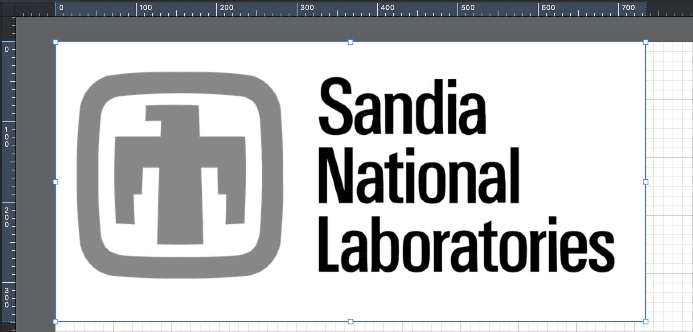
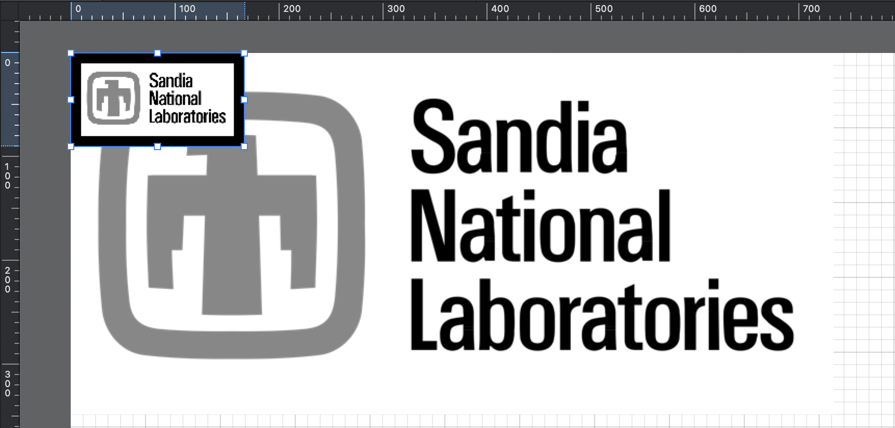

# `downscale`

---

`downscale` pads an image stack to make its dimensions evenly divisible by a target resolution, then downscales it to that resolution, effectively reducing the number of voxels for computations like Finite Element Analysis, resulting in a significant reduction in image resolution while adding padding to maintain dimension compatibility.

---

With `recon3d` installed in a virtual environment called `.venv`, the `downscale` functionality is provided as a command line interface.

We will use the subject `thunder_gray.tif` for demonstration:



The subject file, a grayscale image with `734x348` of pixel resolution, is shown in the Graphic app to demonstrate pixel height and width.

Contents of `downscale_thunder.yml`:

```yml
<!-- cmdrun cat downscale_thunder.yml -->
```

`downscale downscale_thunder.yml` produces:

```sh
<!-- cmdrun downscale downscale_thunder.yml -->
```

The output file is shown below:



Shown together, the grayscale image went from `734x348` to `147x70` (`5x` reduction) plus `10+10` padding to `167x90` of pixel resolution. The downscales image is shown atop the subject image in the Graphic app to demonstrate pixel height and width.  Note the black border padding width of `10` pixels.

A `50_dx.npy` and `50_dx.vtr` file are also saved to the specified `out_dir` that can be used for additional analysis and visualization.
