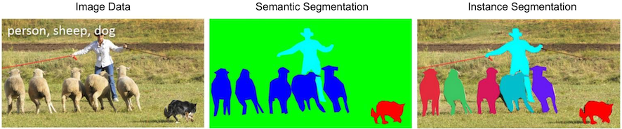

# `instance_analysis`

---

`instance_analysis` takes a semantic image stack and generates an instance image stack for one semantic label at a time, as well as statistics on those instances, such as size, shape from a best-fit ellipsoid, as well as neighborhood metrics.

---

As opposed to semantic segmentation, which groups objects in an image based on defined categories, instance segmentation can be considered a refined version of semantic segmentation wherein individual instances are independently labelled. For example, an image can be semantically segmented to distinguish between different animals (person, sheep, or dog) in an image, while an instance segmentation will label the various individual animals in the image:

Instance analysis provides the user with various metrics for each *instance* of a **semantic label**, such as the size, shape, or orientation of each individual *instance*, enabling a statistical assessment of instance populations from a dataset. This is typically done on individual populations of semantic labels, so an image with multiple sheep and multiple dogs would return separate data for both the sheep and dog populations. Instance analysis on combined semantic labels would require the generation of a new semantic label (e.g. four-legged animals).



With `recon3d` installed in a virtual environment called `.venv`, the `instance_analysis` functionality is provided as a command line interface.  Following is an example of the instance_analysis workflow. Providing a semantic image stack with labeled classes, the instances of each class and associated instance properties can be generated.

Contents of `instance_analysis.yml`:

```yml
<!-- cmdrun cat instance_analysis.yml -->

```

`instance_analysis instance_analysis.yml` produces:

```sh
<!-- cmdrun instance_analysis instance_analysis.yml -->
```

This always outputs an `hdf` file.  The current version of `hdf` file is `hdf5`, so file extensions will terminate in `.h5`. The `hdf` file output can be opened in [HDFView](https://www.hdfgroup.org/download-hdfview/).
