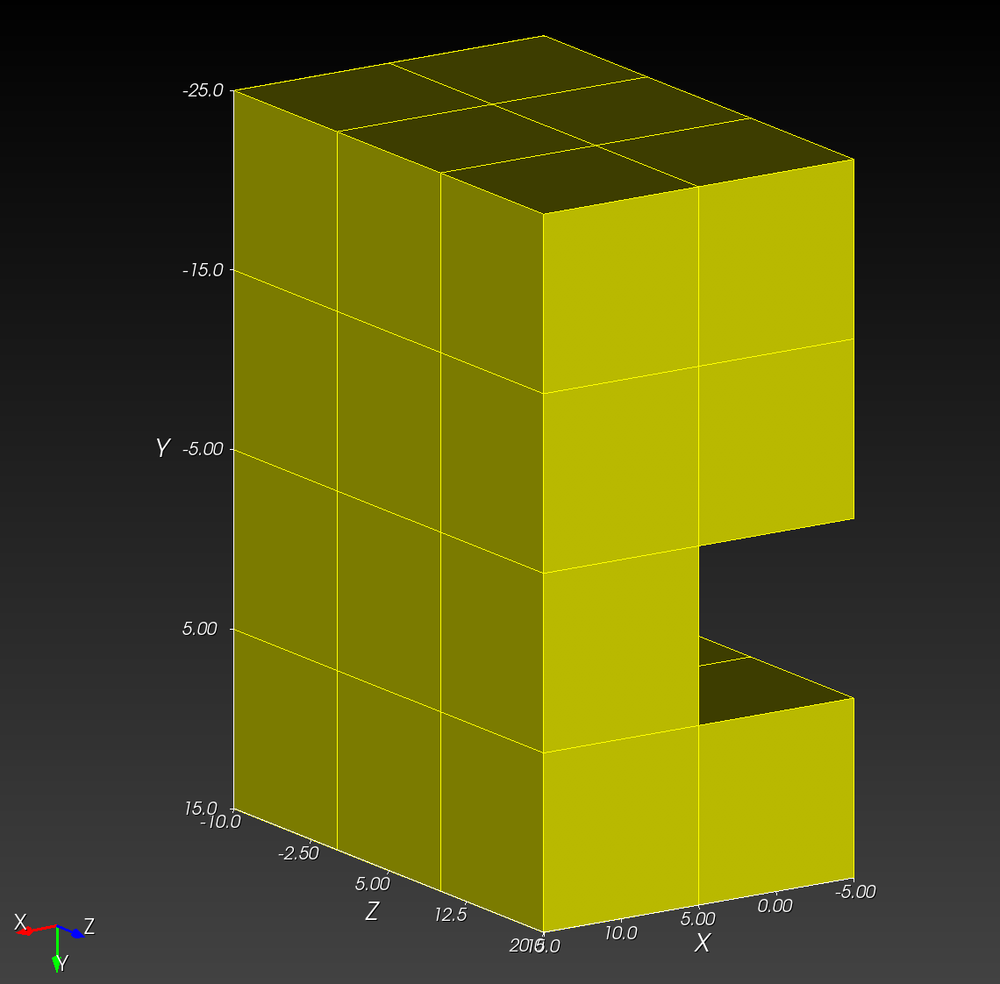
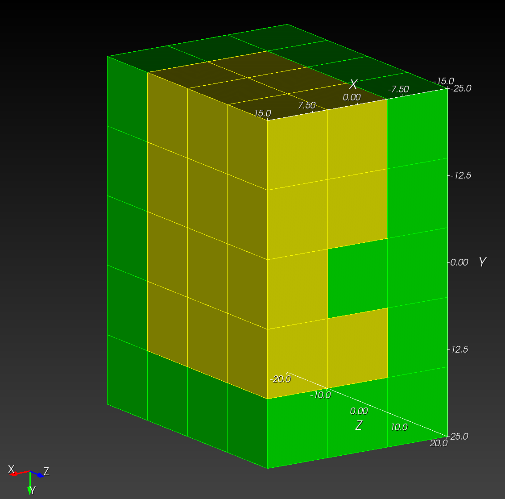

# `voxel_to_mesh`

---

`voxel_to_image` takes a semantic segmentation, encoded as a `.npy` file, plus a `.yml` recipe that holds configuration details, and create an Exodus finite element mesh, suitable for analysis with Sierra Solid Mechanics (SSM).

---

Consider, as an example, the following four images:

letter_f_slice_0.tif | letter_f_slice_1.tif | letter_f_slice_2.tif | letter_f_slice_3.tif
:---: | :---: | :---: | :---:
 |  |  |  | 

This stack of images as a NumPy array, saved to the `letter_f_3d.npy`, has the form:

```python
>>> import numpy as np
>>> aa = np.load("letter_f_3d.npy")
>>> aa
array([[[1, 1, 1],
        [1, 1, 1],
        [1, 1, 1],
        [1, 1, 1],
        [1, 1, 1]],

       [[1, 0, 0],
        [1, 0, 0],
        [1, 1, 0],
        [1, 0, 0],
        [1, 1, 1]],

       [[1, 0, 0],
        [1, 0, 0],
        [1, 1, 0],
        [1, 0, 0],
        [1, 1, 1]],

       [[1, 0, 0],
        [1, 0, 0],
        [1, 1, 0],
        [1, 0, 0],
        [1, 1, 1]]], dtype=uint8)
```

where there are four `z` images, and each image is spanned by the `y-x` plane.

Three `.yml` recipies are considered:

* A mesh composed of only of material 1 (`ID=1` in the segmentation)
* A mesh composed only of material 0 (`ID=0`), and
* A mesh composed of bht materials (`ID=0` and `ID=1`).

## Segmentation `ID=1`

```yml
<!-- cmdrun cat letter_f_3d.yml -->
```

Run `voxel_to_mesh` on `letter_f_3d.yml`,

```sh
(.venv)  recon3d> voxel_to_mesh docs/userguide/src/npy_to_mesh/letter_f_3d.yml
This is /Users/chovey/recon3d/src/recon3d/voxel_to_mesh.py
Processing file: /Users/chovey/recon3d/docs/userguide/src/voxel_to_mesh/letter_f_3d.yml
Success: database created from file: /Users/chovey/recon3d/docs/userguide/src/voxel_to_mesh/letter_f_3d.yml
{'npy_input': '~/recon3d/docs/userguide/src/voxel_to_mesh/letter_f_3d.npy', 'output_file': '~/recon3d/docs/userguide/src/voxel_to_mesh/letter_f_3d.exo', 'remove': [0], 'scale_x': 10.0, 'scale_y': 10.0, 'scale_z': 10.0, 'translate_x': -15.0, 'translate_y': -25.0, 'translate_z': -20.0}
Running automesh with the following command:
mesh -i /Users/chovey/recon3d/docs/userguide/src/voxel_to_mesh/letter_f_3d.npy -o /Users/chovey/recon3d/docs/userguide/src/voxel_to_mesh/letter_f_3d.exo -r 0 --xscale 10.0 --yscale 10.0 --zscale 10.0 --xtranslate -15.0 --ytranslate -25.0 --ztranslate -20.0
Created temporary file in xyz order for automesh: /Users/chovey/recon3d/docs/userguide/src/voxel_to_mesh/letter_f_3d_xyz.npy
Wrote output file: /Users/chovey/recon3d/docs/userguide/src/voxel_to_mesh/letter_f_3d.exo
Temporary file successfully deleted: /Users/chovey/recon3d/docs/userguide/src/voxel_to_mesh/letter_f_3d_xyz.npy
```

The resulting mesh appears in Cubit as


Tip: To reproduce the view in Cubit to match the NumPy ordering, do the following

```sh
Cubit>
view iso
up 0 -1 0
view from 1000 -500 1500
```

## Segmentation `ID=0`

```yml
<!-- cmdrun cat letter_f_3d_inverted.yml -->
```

Run `voxel_to_mesh` on `letter_f_3d_inverted.yml`,

```sh
(.venv)  recon3d> voxel_to_mesh docs/userguide/src/npy_to_mesh/letter_f_3d_inverted.yml
This is /Users/chovey/recon3d/src/recon3d/voxel_to_mesh.py
Processing file: /Users/chovey/recon3d/docs/userguide/src/voxel_to_mesh/letter_f_3d_inverted.yml
Success: database created from file: /Users/chovey/recon3d/docs/userguide/src/voxel_to_mesh/letter_f_3d_inverted.yml
{'npy_input': '~/recon3d/docs/userguide/src/voxel_to_mesh/letter_f_3d.npy', 'output_file': '~/recon3d/docs/userguide/src/voxel_to_mesh/letter_f_3d_inverted.exo', 'remove': [1], 'scale_x': 10.0, 'scale_y': 10.0, 'scale_z': 10.0, 'translate_x': -15.0, 'translate_y': -25.0, 'translate_z': -20.0}
Running automesh with the following command:
mesh -i /Users/chovey/recon3d/docs/userguide/src/voxel_to_mesh/letter_f_3d.npy -o /Users/chovey/recon3d/docs/userguide/src/voxel_to_mesh/letter_f_3d_inverted.exo -r 1 --xscale 10.0 --yscale 10.0 --zscale 10.0 --xtranslate -15.0 --ytranslate -25.0 --ztranslate -20.0
Created temporary file in xyz order for automesh: /Users/chovey/recon3d/docs/userguide/src/voxel_to_mesh/letter_f_3d_xyz.npy
Wrote output file: /Users/chovey/recon3d/docs/userguide/src/voxel_to_mesh/letter_f_3d_inverted.exo
Temporary file successfully deleted: /Users/chovey/recon3d/docs/userguide/src/voxel_to_mesh/letter_f_3d_xyz.npy
```



Remark: For consistency with the following two-material case, we have changed the color from green, the original color on import into Cubit, to yellow.

## Segmentation `ID=0` and `ID=1`

```yml
<!-- cmdrun cat letter_f_3d_two_material.yml -->
```

Run `voxel_to_mesh` on `letter_f_3d_inverted.yml`,

```sh
(.venv)  recon3d> voxel_to_mesh docs/userguide/src/npy_to_mesh/letter_f_3d_two_material.yml
This is /Users/chovey/recon3d/src/recon3d/voxel_to_mesh.py
Processing file: /Users/chovey/recon3d/docs/userguide/src/voxel_to_mesh/letter_f_3d_two_material.yml
Success: database created from file: /Users/chovey/recon3d/docs/userguide/src/voxel_to_mesh/letter_f_3d_two_material.yml
{'npy_input': '~/recon3d/docs/userguide/src/voxel_to_mesh/letter_f_3d.npy', 'output_file': '~/recon3d/docs/userguide/src/voxel_to_mesh/letter_f_3d_two_material.exo', 'remove': [], 'scale_x': 10.0, 'scale_y': 10.0, 'scale_z': 10.0, 'translate_x': -15.0, 'translate_y': -25.0, 'translate_z': -20.0}
Running automesh with the following command:
mesh -i /Users/chovey/recon3d/docs/userguide/src/voxel_to_mesh/letter_f_3d.npy -o /Users/chovey/recon3d/docs/userguide/src/voxel_to_mesh/letter_f_3d_two_material.exo --xscale 10.0 --yscale 10.0 --zscale 10.0 --xtranslate -15.0 --ytranslate -25.0 --ztranslate -20.0
Created temporary file in xyz order for automesh: /Users/chovey/recon3d/docs/userguide/src/voxel_to_mesh/letter_f_3d_xyz.npy
Wrote output file: /Users/chovey/recon3d/docs/userguide/src/voxel_to_mesh/letter_f_3d_two_material.exo
Temporary file successfully deleted: /Users/chovey/recon3d/docs/userguide/src/voxel_to_mesh/letter_f_3d_xyz.npy
```


